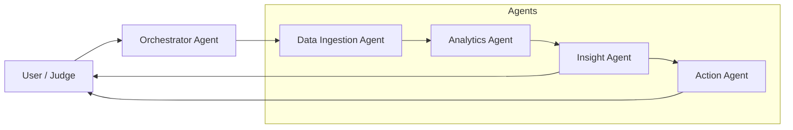
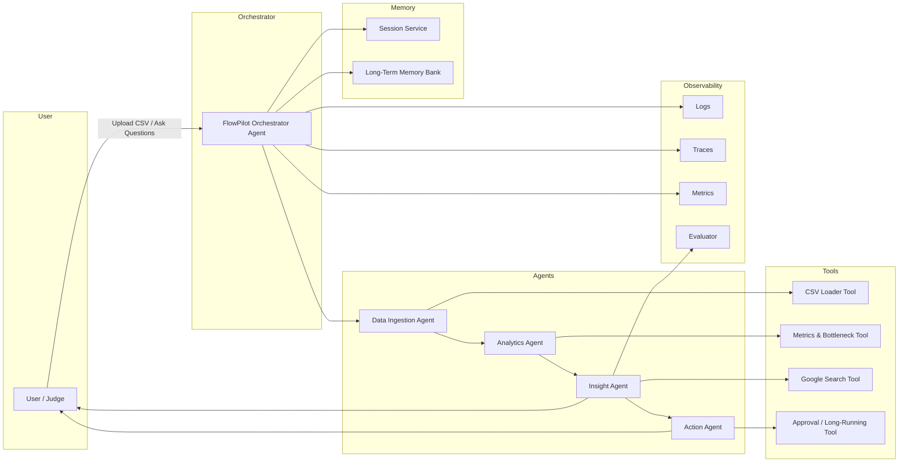
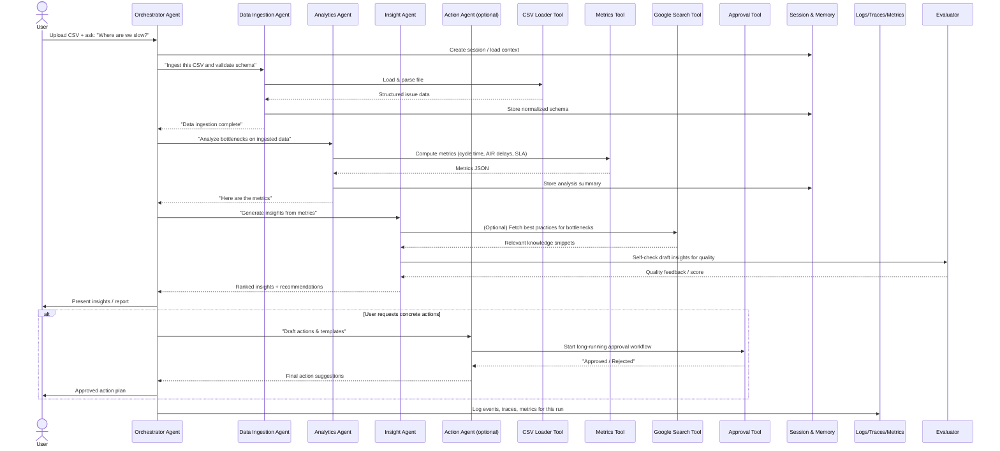

# 🌪️ FlowPilot - Engineering Productivity Insight Agent

---

## 💡 Project Overview

A multi-agent system that analyzes Jira-like issue data (CSV exports) to uncover bottlenecks, diagnose root causes of inefficiency, and accelerate software delivery effectiveness.

Track: **Enterprise Agents**

FlowPilot helps teams answer what standard dashboards cannot:

- Where flow friction emerges across lifecycle stages

- Why resolution time increases over time

- Whether SLA failures are predictable and preventable

- Which team members or workflows are overloaded

- How to systematically reduce AIR-induced delays

- It bridges the gap between metrics visibility and improvement execution.

---

## 🎯 Problem Statement

Engineering teams often rely on issue trackers such as Jira, GitHub Issues, or Linear to manage development workflows (delivery of features and defects). However, the tools themselves rarely provide actionable *diagnostic* intelligence needed to drive improvements.

As a result, critical workflow questions remain unanswered:

- Why are tickets taking longer than expected?
- Where do delays in the lifecycle occur?
- Which statuses or handoffs create bottlenecks?
- How does **Additional Info Required (AIR)** impact resolution time?
- Are SLA breaches predictable?

Without dedicated process analysis, teams spend hours manually extracting CSVs into spreadsheets, a process that is:

⏳ Time-consuming

❌ Error-prone

🔁 Not repeatable

🚫 Not scalable

🧱 Lacking insights toward actions

Engineering productivity demands smarter, diagnostic tools.

FlowPilot targets to solve this problem.

---

## 🚀 Solution Statement

FlowPilot is an **AI-driven, multi-agent analytics system** powered by **Gemini + ADK** which:

✔ Ingests exported issue CSV data

✔ Computes lifecycle bottleneck metrics (AIR & SLA impact)

✔ Diagnoses causes of delays (root-cause analysis)

✔ Recommends prioritized improvement strategies

✔ Uses Google Search to enrich insights with best practices

✔ Supports contextual follow-up Q&A using session memory

✔ Provides human-approval workflow for actionable proposals


Under the hood, FlowPilot applies:

- Multi-agent orchestration

- Custom tool integrations

- Sessions + long-term memory

- Observability (logs, metrics, traces)

- Evaluation (LLM-as-judge scoring)

FlowPilot shortens the path from data → understanding → action.

---

## 🧠 Architecture

FlowPilot uses a **team of cooperating agents** under an Orchestrator:

- 📥 **Data Ingestion Agent**: validates and normalizes CSV issue data  
- 📊 **Analytics Agent**: computes bottlenecks, SLA compliance, AIR impacts  
- 🔍 **Insight Agent**: produces narrative explanations & improvement strategies  
- 🧩 **Action Agent**: drafts an action plan that requires user approval  

### 🖼 System Architecture Diagrams

High-Level Diagram




Agent Sequence Diagram (Typical Run)


### 🧩 Technical Implementation

FlowPilot demonstrates these key concepts:

| Concept            | Implementation                                             |
| ------------------ | ---------------------------------------------------------- |
| Multi-Agent System | Four specialized agents + orchestrator agent               |
| Tools              | CSV loader, metrics, long-running approvals, Google Search |
| Sessions           | Each analysis maintains contextual state                   |
| Memory             | Long-term process knowledge storage                        |
| Observability      | Logs, traces, metrics instrumentation                      |
| Agent Evaluation   | LLM-as-Judge quality scoring                               |
| A2A Readiness      | Analytics agent isolated for remote calls (future option)  |

FlowPilot uses a sequential + parallel multi-agent pattern coordinated by an Orchestrator:

### 🤖 Agent Roles

1️⃣ Data Ingestion Agent

- Reads CSV input

- Validates columns (ticket_id, air_hops, etc.)

- Normalizes statuses & timestamps

- Publishes structured issue list to shared state

2️⃣ Analytics Agent
Computes:

- Avg resolution time by team/assignee

- Bottleneck priority ranking

- AIR impact (air_hops + air_days correlation)

- SLA compliance %

- Summarized lifecycle delays

3️⃣ Insight Agent
Transforms metrics into:

- Root-cause hypotheses

- Practical remediation strategies

- Priority-ranked recommendations

- Enriches via Google Search tools

4️⃣ Action Agent (long-running operation pattern)

Drafts an improvement action plan:

- SLA guardrails

- Reducing waiting time

- Load balancing assignees

- Standardizing AIR resolution
  
Pauses → waits for user approval → resumes


Communication across agents uses ADK sub-agent orchestration & shared context memory.

### Data Model

Supports:

- Included sample dataset (data/sample_issues.csv)

- Any Jira like CSV with compatible schema

📌 Future scope: integrate direct Jira REST API & GitHub Issues API

No CSV required → real-time operational intelligence.

### Sessions & Memory

Two-layer memory system:

| Type             | Purpose                                                        |
| ---------------- | -------------------------------------------------------------- |
| Session Memory   | Maintains question/response context during a single analysis   |
| Long-Term Memory | Stores org-specific rules (Ex: SLA values, delay categories) |

### Observability & Evaluation

| Category   | Evidence in FlowPilot                       |
| ---------- | ------------------------------------------- |
| Logging    | Tool usage + agent boundaries               |
| Tracing    | Orchestrator → sub-agent delegation history |
| Metrics    | total requests + latency                    |
| Evaluation | LLM-as-judge scores insight quality         |

Designed for continuous improvement feedback loops.

### Deployment Capabilities

- A2A protocol-ready for remote agent interactions

- Deployable on Vertex AI Agent Engine

- Can integrate with enterprise alerting systems in future

---

## 🧪 Sample Data

To simplify testing, a sample CSV is included:
```bash
data/sample_issues.csv
```
Replace with your own Jira-like exports (CSV format) anytime.

---

## ▶️ How to Run
🔹 Local CLI
```bash
pip install -r requirements.txt
export GOOGLE_API_KEY="PASTE_YOUR_ACTUAL_API_KEY_HERE"

# Run agent in terminal
adk run flowpilot_agent

# Or launch web UI
adk web
```
🔹 Running in ADK Web mode
```bash
adk web
```
Open → http://127.0.0.1:2800

Select → flowpilot_agent / root_agent

Upload a CSV, and chat.

---

## 📈 Value Statement

FlowPilot provides actionable engineering workflow insighta:

- Top 3 bottleneck statuses (Ex: “Waiting for Customer”)

- SLA predictability & improvement trend tracking

- Impact of Additional Info Required (AIR) on delivery

- Role-based workload fairness and throughput analysis

- Structured improvement proposals backed by data


This intelligence help the following stakeholders:

| Role         | Benefit                         |
| ------------ | ------------------------------- |
| Dev Leads    | Faster delivery flow            |
| PMs          | More predictable timelines      |
| Team Members | Fewer handoff delays            |
| Leadership   | Health of engineering execution |

📊 Example measurable value:

- Reduce cycle delays by >60% by fixing top two bottleneck statuses

- Cut AIR-related rework using standardized resolution templates

- Improve mean resolution time through load redistribution

- Weekly performance trending using memory-based insights

- FlowPilot accelerates engineering flow toward reliable delivery excellence.

---

## 🔮 Future Work

🔌 Direct Jira REST API integration
  → No more CSV uploads: live workflow intelligence

🧩 MCP-enabled connectors for enterprise scale

📊 Predictive analytics (bottleneck anomaly detection)

🔔 Proactive alerts when work gets stuck

🧠 Auto-generated JQL automation proposals

---
